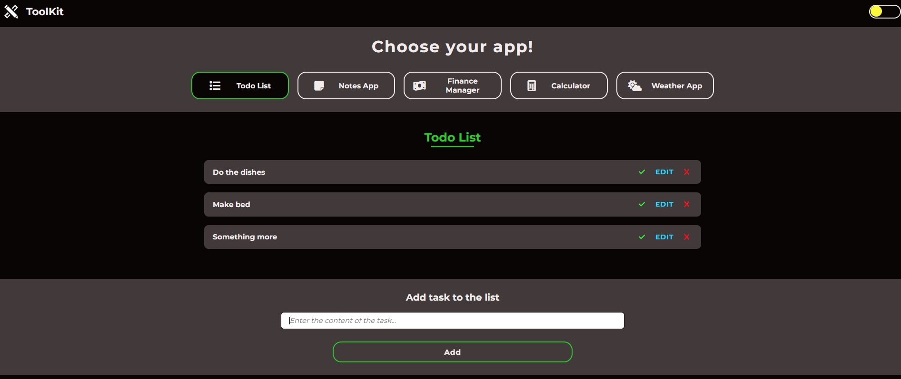
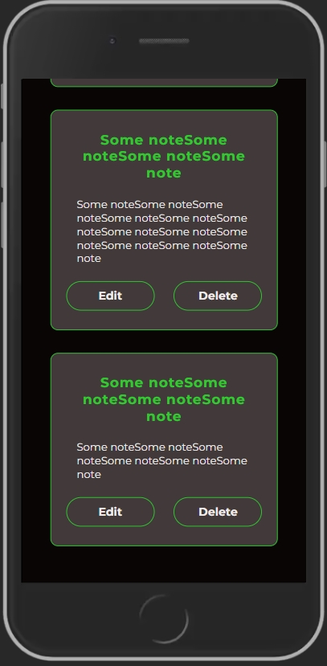
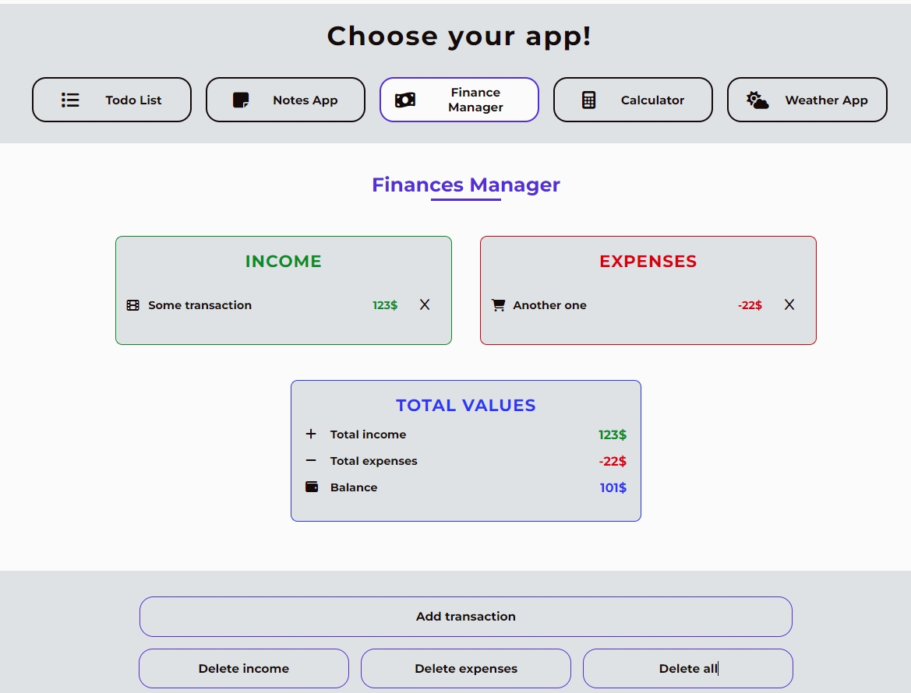
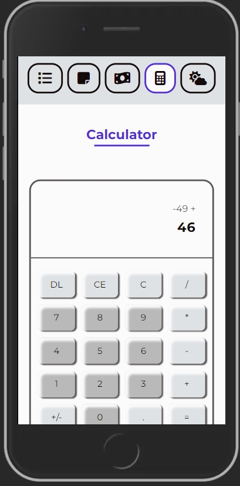
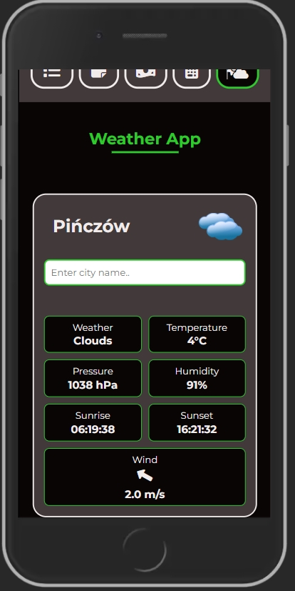

<h1>ToolKit</h1>

Hello, I present to you my ToolKit project. The page includes 5 applications: <b>ToDo List, Note App, Finances Manager, Calculator and Weather App</b>. The project is created in React using Create React App, React Router and React Redux.
The sites are responsive, using Local Storage to contain informations (like tasks, notes etc.) and adapted in terms of accessibility.

I encourage you to check the website - uploaded to netlifly <a href='https://toolkiit.netlify.app'>ToolsKit</a>

<h2>📫 Page contains</h2>

- five different sites with 5 different tools,
- responsible design,
- accessibility practices,
- light / dark themes,

<h2>🛠 Used tools / programming languages / technologies</h2>

- HTML / CSS,
- React (React Redux, React Router),
- page is using Local Storage to contain typed data,
- git / github.

<h2>👩‍💻 Applications</h2>

- <b>ToDo List</b> - add task, edit task, check done task, delete task. Application is using Local Storage to store tasks and check their status.

- <b>Note App</b> - add note, edit note, delete note / all notes. Also using Local Storage to store the name of a note and content.

- <b>Finances App</b> - add transaction, allocating transaction to income or expenses, delete one transaction / all transactions, count income, expenses and the whole amount. Matches icon with selected type of transaction. Using Local Storage.

- <b>Calculator</b> - the ability to perform basic mathematical calculations, protected from the most common mathematical issues, e.g. dividing by 0.

- <b>Weather App</b> - allows to search weather for cities all around the world - shows basic information about weather situation. It also has a clock with the time zone of the selected city. Using Local Storage and based on [Weather API](https://openweathermap.org/).

